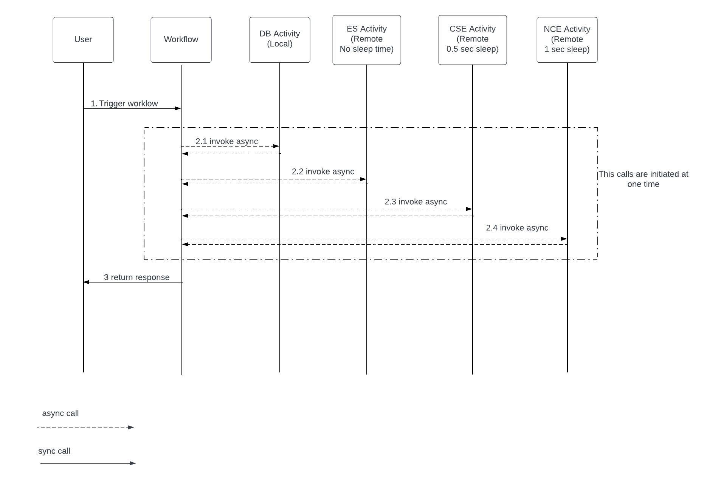

# Temporal Workflow framework

This project contains simple setup to show Temporal workflow orchestrator functionality.

Notes:
To use "io.temporal:temporal-spring-boot-starter-alpha" lib you have to add configs to application.yaml

To trigger workflow - use Postman with POST method:
URL: `http://localhost:3031/api/startWorkflow` 

body:
`{
"input": "inputMsg1"
}`

and header:
`Content-Type : application/json`

### Workflow structure

DBActivity(app1)- Local activity- is deployed to Worker 1 together with Workflow itself.

ESActivity(app3)- Remote activity- doesnt have Thread.sleep

CSEActivity(app2)- Remote activity- has Thread.sleep (500 ms)

NCEActivity(app4)- Remote activity- has Thread.sleep (1 sec)

### Build artifact

Build jar:
`gradle clean build`

Login into ECR:
`aws ecr get-login-password --region us-east-1 | docker login --username AWS --password-stdin awsAccountId.dkr.ecr.us-east-1.amazonaws.com`

Build docker image and push to Elastic Container Repository(ECR): run script `buildDockerImage.sh`

### Prometheus metric endpoint

Metric endpoint URL: `http://localhost:3031/actuator/prometheus` 
